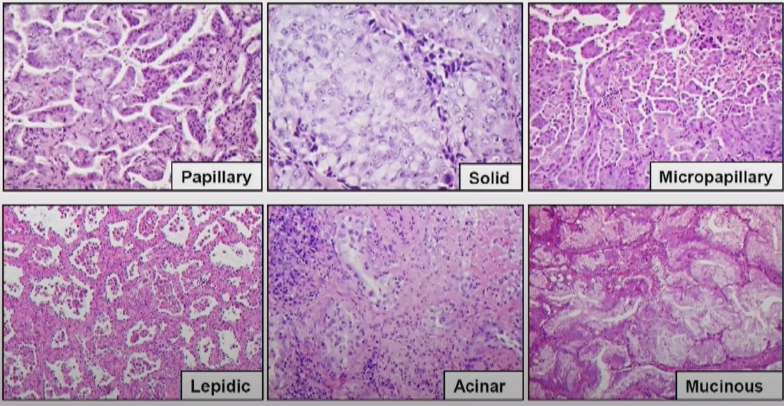

# AILCAP 

### Synopsis
 An implementation of various deep learning image segmentation models in [digital pathology field](https://en.wikipedia.org/wiki/Digital_pathology). WSI (Whole slide Image) file is the main file we are working on by using [openslide](https://openslide.org/api/python/) python library. We utilize openslide by dividing the pathology slides into smaller section so that we can process each section individually. After that, we can train and use models to recognize abnormal features in particular slides and finally merge the result regions together.

### Specification
 We decide to choose non-small cell lung cancer as targeted disease. We further divide the focus to adenocarcinoma which has 5 subtypes and 1 variant including papillary, solid, micropapillary, lepidic, acinar, and mucinous respectively.

  
   
  <a href="https://www.youtube.com/watch?v=-vtFloUyYpE">Histopathology of Non-Small Cell Lung Cancer (Dr. Sarawut Kongkarnka)
</a>

> We have limited experiences in pathology field, so advising from experts is needed and we have to narrow the targeted pattern down to lepidic, acinar, and micropapillary.
<!--   -->

# Challenges
- limited computing power, especially with large files like .svs (~2GB+)
- Models' abilities to comprehend features, especially with small ones.
- Limited amount of focused cancer WSI which implies to dataset shortages
- Abnormal features that lie across multiple grid sections
- How to actually handle large output segmented images?

<!--   -->

# Model choices
Commonly, in segmentation there are various deep learning models which are published with well-written documentation paper. The following models are interesting models for pathology segmentaion tasks.

[Ultralytics YOLO](https://docs.ultralytics.com/)|  [U-net architecture](https://arxiv.org/pdf/1505.04597) | [Detectron2](https://github.com/facebookresearch/detectron2)
:----------:|:------:|:------------:|
 |  | 

Each of them has different pros and cons that we need to test and compare their results and appropriately adapt to challenges.

# Tools
Before we dive into possible ways to address aforementioned problem, let's list out available tools related to the problem.

|DL models|Python libs|Desktop App|Pathology tools|
|----------------------------------------------------------|----------------------------------------------------------|---------------------------------------------------------------------------------------------------|---------------------------------------|
|[Segmentation Models](https://github.com/qubvel/segmentation_models)|[tensorflow](https://www.tensorflow.org/)|[html](https://developer.mozilla.org/en-US/docs/Web/HTML) [css](https://developer.mozilla.org/en-US/docs/Web/CSS) [javascript](https://developer.mozilla.org/en-US/docs/Web/JavaScript)|[QuPath](https://qupath.github.io/)|
|[Ultralytics YOLO](https://docs.ultralytics.com/)|[keras](https://keras.io/)|[Nodejs](https://nodejs.org/en)|[ImageJ](https://imagej.net/ij/)|
|[Detectron2](https://github.com/facebookresearch/detectron2)|[albumentations](https://albumentations.ai/)|[Electronjs](https://www.electronjs.org/)||
||[numpy](https://numpy.org/)|[Openseadragon](https://openseadragon.github.io/docs/)||
||[matplotlib](https://matplotlib.org/)|[GeoTIFFTileSource](https://github.com/pearcetm/GeoTIFFTileSource)||
||[pillow](https://pillow.readthedocs.io/en/stable/)|||
||[cv2](https://opencv.org/get-started/)|||
||[tifffile](https://github.com/cgohlke/tifffile/tree/master)|||
||[openslide](https://openslide.org/)|||

# Tackling Challenges

### limited computing power
At a glance, we can easily divide WSI file into large amount of smaller tiles. The number of tiles obviously depends on the size of extracted tiles. In this case, we choose **256px * 256px**. Additionally, we need to add overlaps (~25px) between tiles to ensure that each image provides some context for certain region.
> * This way models also have a chance to perceive tiny details in WSI. 
> * Normally, WSI dimensions are around 105px * 105px, thus, we are going to obtain large dataset from WSI. 
> * Along with data augmentation techniques which are processes of rotating, cropping, flipping data to gain another data out of existing data. These images will be given to models to ensure ability of generalizing images.

### Abnormal features belong to several tiles
When the abnormal features are lying across multiple tiles, we can't use "object detection model" easily as it frames the features with boxes so it is hard to merge boxes from each tile. Instead, we use segmentation model to "color" interested features so we can easily merge grids together.

###  How to actually handle large output segmented images?
Desktop application needs to wait for the script to fully **merge segmented area** together. We'll highlight tiles that has particular class on it on downsampled WSI. The highlighted areas will be clickable and it will take user to correspond merged result images from the models.
